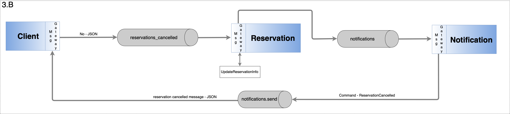
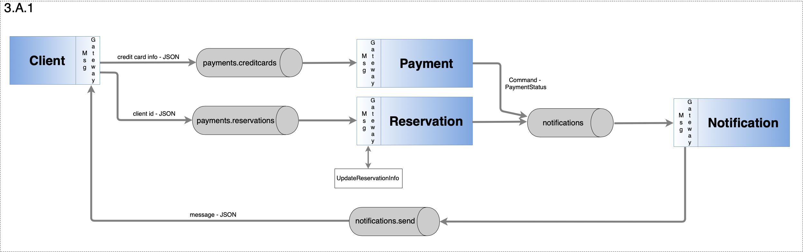

# Enterprise Integration Patterns :office::chains::scroll:

The main objective of this repository is to demonstrate the use of :bridge_at_night: integration platforms and middleware. Insights about the best practices:medal_military:for integrating enterprise applications were gained from the book:closed_book:[Enterprise Integration Patterns](https://www.enterpriseintegrationpatterns.com) _by Gregor Hohpe_.

 

---
## Getting Started :clapper:
NB:bangbang: **Before** running our 2 projects, make sure you have _RabbitMQ_ running :rabbit:.  

If you have _Docker_ within reach :whale: you can simply run the following command to start it:

<code>docker run --rm --name rabbitMQ -p 15672:15672 -p 5672:5672 rabbitmq:management</code>
  

> Optional: To make sure _RabbitMQ_ is running, navigate to `localhost:15672`in your browser

 

---
## Business Scenario :briefcase:
Writtend description of the depicked scenario can be found in a [pdf format](https://github.com/datsoftlyngby/soft2019fall-lsd-teaching-material/blob/master/week36/case_car_article.pdf).

<em>BPMN</em>

 

---
## Application architecture :building_construction:

We have 6 services within this project: 

**Client** - This is the main CLI that the customer will use. It takes input from the user and using queues makes requests to the necessary services. It also has an active listener on new notifications so there is a centralized way of sending information back to the client.

**Reservation** - It is used to keep track of reservations that have been made on the system. It can take requests for new reservations and orchestrates some of the processes needed to complete one.

**Package** - The package service serves the purpose of keeping deals available to the clients. These packages are the actual consumable for the client which will have the choice between a few of them.

**Car** - Acts as a repository. It keeps knowledge about the current cars existing in the system, including their prices and descriptions.

**Notification** - As mentioned before the notifications system is the centralized way of talking back to the client. It takes a message and some command which when passed to the client will lead to certain actions being executed.

**Payment** - A very simple implementation of a payment service. It takes requests which include credit card information and randomly decides if this card should be accepted or declined.

 

The following architecture diagrams provide an insight (various sequential scenarious) on how the software implementation has been made:

<em>Reservation initiation</em>

 

<em>Packages generation process</em>

 

<em>Choosing a package deal</em>

 

<em>Declining an offer</em>

 

<em>Payment process</em>

 
 

The entire software architecture can be seen below:

<em>Architecture</em>

 

---
## Software Implementation :keyboard:

Our solution illustrates the implementation of at least :five: enterprise integration patterns:
- `Messaging Gateway` - as a class to wrap messaging-specific method calls
- `Correlation Identifier` - assigns the request a request ID that will be used to processes the reply ( by correlation Id - we know which request the reply is for)
- `Point-To-Point` - RPC
- `Publish-Subscribe Channel` - when sending notifications
- `Message-Translator` - translate one data format into another
- `Command Message`
- Others

The data processed by the application exists in two different formats - JSON and XML.

 

---
> #### Assignment made by:   
`David Alves 👨🏻‍💻 ` :octocat: [Github](https://github.com/davi7725)  
`Elitsa Marinovska 👩🏻‍💻 ` :octocat: [Github](https://github.com/elit0451)  
> Attending "System Integration" course of Software Development bachelor's degree
